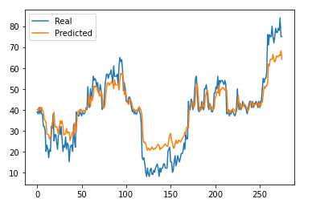

# Project #2 Final Analysis
  Bitcoin Sentiment Analysis and Trade Signal Evaluation 

## Group Members: Alex Waters, Joe Swiderski,  Ivan Tatum

* We are looking to attempt to determine if we can predict bitcoin prices using the fear and greed index as a proxy for sentiment analysis. Are we bale to make buy or sell decisions in bitcoing to take advantage of price moves.

* Gathering Data 

  - Obtain bitcoin price, S&P, 500 and bitcoin volume as feathure to evaluate. This data was o btain from Google Sheets and Yahoo.
  - We had to use the TWitter API (TWeepy) to download twitter feeds.
  - Score these tweets for positive, negagtive, or neutral sentiment 
  - Use VADER, IBM Watson, FNG to produce sentiment scores 
  - CCreated a dashboard to evaluate the fear and greed index scores in rela time using as much data as will feed into the program (300 tweets every 5 minutes)

* Getting reliable data was the first item to tackle. We eventually used data from February 2018 to Current because of the availability of free data to pull.  In the data training process, we used the LSTM and SARIMAX models to evaluate how well the models predicted the bitcoin price. ONce the data was trained by these models, using 70% of the data and testing the data with the remining 30%, we could get evaluate the predictive ability of the model.

### MOdels 
* We used the Long short-term memory recurrent neural network(LSTM RNN) which is helpful in making prediction with time series data. 
* We chose to use the closing price of bitcoing to predict future results. 
* We used the model with window =1,5,10.  Due to the volitility in Bitcoin the smallest window left us with the best outcomes.
* We trained the model with 15 and 50 epochs.  We got similiar outcomes.
 
---
*LSTM RNN FNG*
* We used the Fear and Greed data for Bitcoin to train our model.
* We used windows with 1,5,10 and trained with 50 epochs. 
* The plot of predicted vs real values plotted along in a similiar fashion.

---
* SARIMAX: BTC, BTC_VOL, SP_500, FNG_Value*
* SARIMAX stands for Seasonal Autoregressive Integrated Moving Average Exogenous model.  
* This model allowed us to compart multiple values to see if it allowed for a better predictive model. 
* We ran the model with different variables and found that no combination came out with signifigantly better outputs.
* Based on the data the arima model gate a best fit recommendation for the SARIMAX (0,1,1). When the combination of variables was altered so was the recommendation.

* The SARIMAX model is a regression model used to evaluate seasonality and to make predictions if seasonality did exit. Many investments have seasonal components and therefore, we used this model to rule out the possibility of seaosnality.

* Both the LSTM and teh SARIMAX models had poor rsults when itcomes to predictive power. There is simply not enough relvant data to use to be able to extract features relevant to predicting price. There is a lot of extraneous data that has no effect on bitcoin price action. We do believe the passage of time and the adoption of cryptocurrency as a norm will allow the model to eveolve so that tey will eventuall yhave more predictve power.

