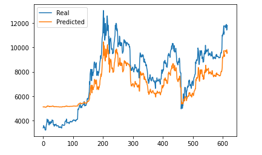
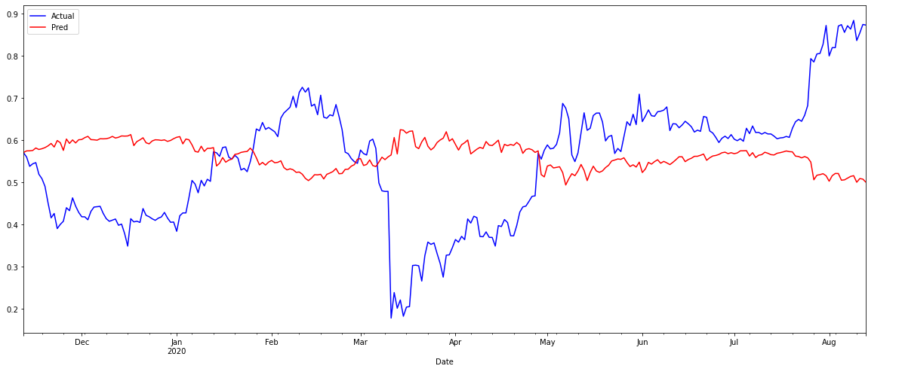

#Project 2 
## Bitcoin
### Alex Waters 8/26/20

---
**LSTM RNN and SARIMAX models**

*LSTM RNN Bitcoin*
We used the Long short-term memory recurrent neural network(LSTM RNN) which is helpful in making prediction with time series data. 
We chose to use the closing price of bitcoing to predict future results. 
We used the model with window =1,5,10.  Due to the volitility in Bitcoin the smallest window left us with the best outcomes.
We trained the model with 15 and 50 epochs.  We got similiar outcomes.

 
---
*LSTM RNN FNG*

We used the Fear and Greed data for Bitcoin to train our model.
We used windows with 1,5,10 and trained with 50 epochs. 
The plot of predicted vs real values plotted along in a similiar fashion.

---
*SARIMAX: BTC, BTC_VOL, SP_500, FNG_Value*

SARIMAX stands for Seasonal Autoregressive Integrated Moving Average Exogenous model.  
This model allowed us to compart multiple values to see if it allowed for a better predictive model. In the code there is a steps variable.  we set it to -1. That means it took data from the previous day to use for the predictions.  With the amount of fluctuation in the data, we did not move to use data further in the past, but that could be an option for the future.
We ran the model with different variables and found that no combination came out with signifigantly better outputs.
Based on the data the arima model gate a best fit recommendation for the SARIMAX (0,1,1). When the combination of variables was altered so was the recommendation.

